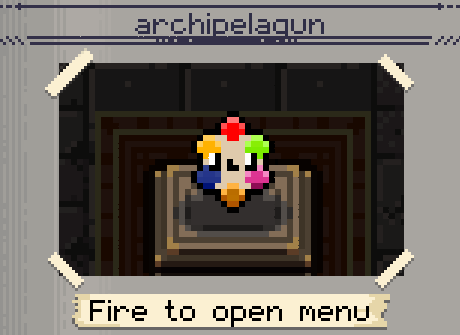

# Gungeon Archipelago Reloaded
A revised mod for connecting Enter The Gungeon to Archipelago https://archipelago.gg

# APWorld Download
APWorld releases found here (https://github.com/MaoBoulve/ArchipelaGunAPWorld/releases)

* **v0.1.1 - current**: Enter the Gungeon APWorld v0.1.1
* **v0.0.4 - v0.0.7**: Enter the Gungeon APWorld v0.0.1
* **v0.0.1 - 0.0.3**: KinTheInfinite Gungeon APWorld (https://github.com/KinTheInfinite/Archipelago/releases)

# Connecting To A Server

 * On run start, the Archipelagun will spawn. Fire to open the mod menu
 
 * Following commands are available:
 * connect (ip) (port) (slot name) --- [Connect to room. Space separated, without the parenthesis]
 * retrieve --- [Retrieve items from server, once per run ]
 * progress --- [Print out goals and current state of game completion]
 
 * fullconnect (ip) (port) --- [Workaround connection option for handling player names with spaces & rooms with passwords. Use with 'set'.]
 * set (option) --- [Replace 'option' with Name or Password. Set parameters for 'fullconnect']

# Credits:
 * MaoBoulve - main developer
 * KinTheInfinite - developer for previous Archipelago mod
 
# Contact:
 * Discord - Geers
 * Email - NelBoulve@gmail.com